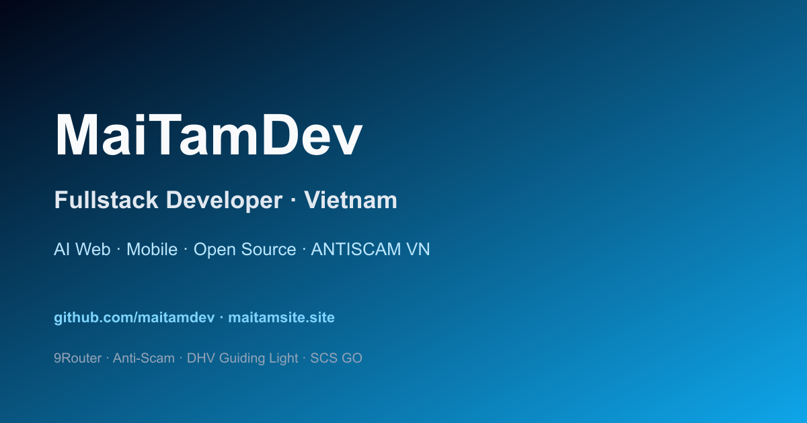

# MaiTamDev Portfolio



Interactive 3D portfolio of **MaiTamDev** — Fullstack Developer from Vietnam.

Built on a Three.js + Rapier interactive world (based on Bruno Simon’s portfolio engine), customized with MaiTam content, projects, and branding.

Live: [maitamsite.site](https://maitamsite.site) · GitHub: [maitamdev](https://github.com/maitamdev)

## Setup

1. Install [Node.js](https://nodejs.org/en/download/)
2. Copy env file:

```bash
cp .env.example .env
```

3. Install and run:

```bash
# Install dependencies
npm install --force

# Dev server (default Vite port, usually http://localhost:5173)
npm run dev

# Production build → dist/
npm run build

# Preview production build
npm run preview
```

Optional:

```bash
# Regenerate career labels / lab cards / share image placeholders
npm run generate-assets

# Compress static GLB / textures (needs KTX tooling for full pipeline)
npm run compress
```

## Production notes

- Renderer defaults to **WebGL** for Chrome stability. Opt into WebGPU with `#webgpu` or `VITE_FORCE_WEBGPU=1`.
- Multiplayer features (whispers, circuit leaderboard) need `VITE_SERVER_URL`. Without it the site stays fully playable offline.
- Recommended production env:
  - `VITE_COMPRESSED=1`
  - `VITE_MUSIC=1`
  - `VITE_LOG=0`
  - `VITE_ANALYTICS_TAG=` (optional)
  - `VITE_SERVER_URL=` (optional)

## Deploy (Vercel)

- Build command: `npm run build`
- Output directory: `dist`
- Framework preset: Other
- `vercel.json` is included for cache headers on assets / WASM / GLB / KTX

## Credits

- Original 3D portfolio engine & world design: [Bruno Simon](https://bruno-simon.com)
- MaiTamDev content, branding, projects, and customizations © 2026 MaiTamDev
- License: MIT (see `license.md`)
